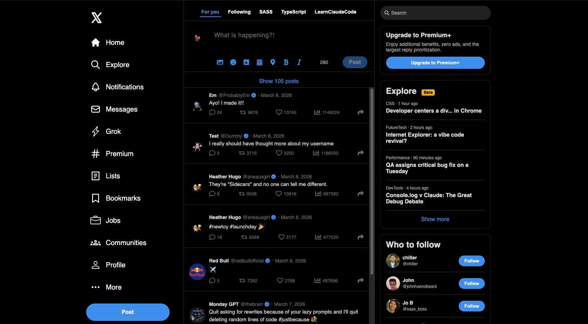

# X Clone Trooptorial

A full-stack X (formerly Twitter) clone built with Next.js, TypeScript, Firebase, and SCSS.



🔗 **Live Demo:** [x-clone-trooptorial.vercel.app](https://x-clone-trooptorial.vercel.app)
- Test account preloaded for login, or signup (@fakeemail.com) to create your own user and add to the fun!

---

## Tech Stack

- **Framework:** Next.js 15 (App Router)
- **Language:** TypeScript
- **Auth & Database:** Firebase Authentication + Firestore
- **Styling:** SCSS Modules
- **Deployment:** Vercel

---

## Features

- Email/password signup and login via Firebase Auth
- Tweets attached to user in Firebase and editable only by user when logged in
- Profile photos ramdomly auto-assigned to avoid storage fees but keep it fun
- Engagement counts editable and reflect real Firestore data with a randomized boost on load
- Responsive layout with SCSS modules

---

## Getting Started

### Prerequisites
- Node.js
- A Firebase project with Authentication and Firestore enabled

### Installation

```bash
git clone https://github.com/SneauxGirl/x-clone-trooptorial.git
cd x-clone-trooptorial
npm install
```

### Environment Variables

Create a `.env.local` file in the root directory:

```
NEXT_PUBLIC_FIREBASE_API_KEY=
NEXT_PUBLIC_FIREBASE_AUTH_DOMAIN=
NEXT_PUBLIC_FIREBASE_PROJECT_ID=
NEXT_PUBLIC_FIREBASE_STORAGE_BUCKET=
NEXT_PUBLIC_FIREBASE_MESSAGING_SENDER_ID=
NEXT_PUBLIC_FIREBASE_APP_ID=
```

### Run Locally

```bash
npm run dev
```

---

## Author

Built by [@SneauxGirl](https://github.com/SneauxGirl)
Based on the tutorial by [@thehashton](https://github.com/thehashton/x-clone)